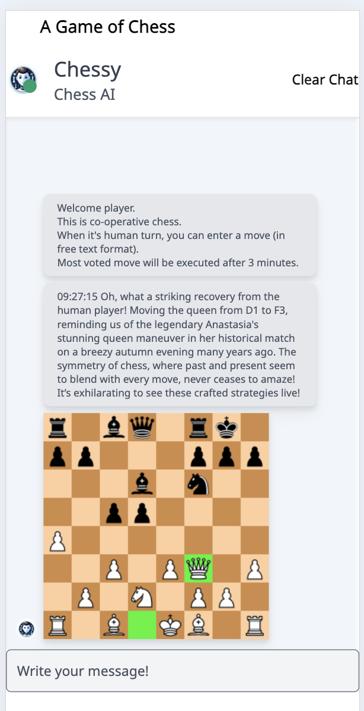

# ai-chess
Play chess against LLM.

The projects is assembled from microservices.
Following services are used from GitHub as is, and are not modified:
- Stockfish server https://github.com/hyugit/stockfish-server/ with GPLv3 license)
- chess-api https://github.com/anzemur/chess-api with MIT license

The rest are home-made and with MIT license.
- chess-ui (this is effort of multiple people)
- game-service

